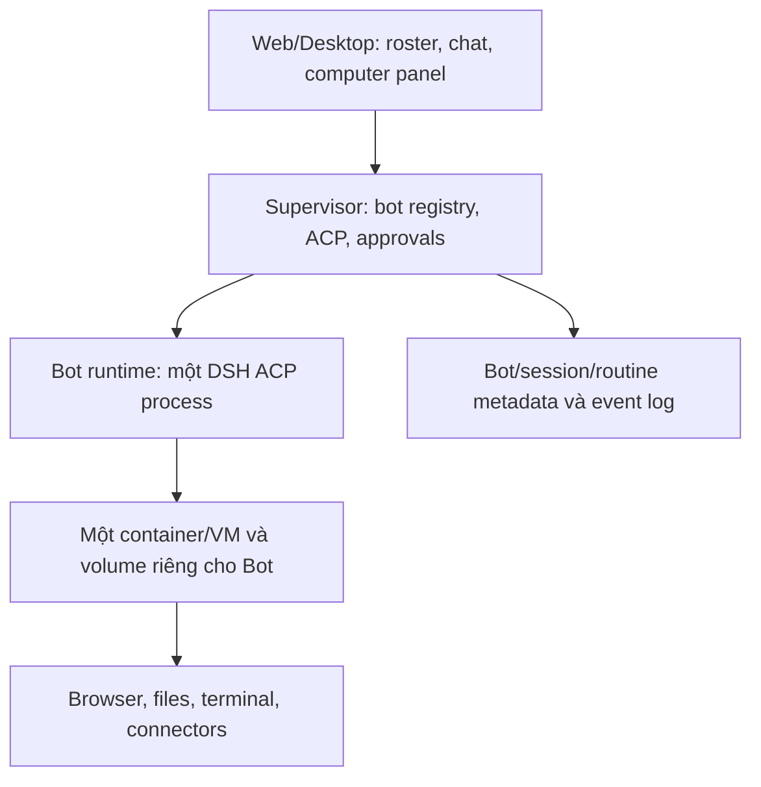

# DSH làm nền cho sản phẩm AI teammates: bản tổng hợp để thảo luận với Claude

**Ngày tổng hợp:** 07/10/2026  
**Mục đích:** Chuyển toàn bộ kết luận và câu hỏi của cuộc thảo luận thành một brief độc lập. Đây là phân tích tài liệu công khai, chưa phải báo cáo chạy thử hay audit mã nguồn tại máy của người dùng.

## 1. Mục tiêu và quyết định đã chốt

Tôi muốn xây một sản phẩm lấy cảm hứng từ Grok Bot: nhiều AI teammate có danh tính, hội thoại và công việc lâu dài; dùng máy tính, ứng dụng, tệp và công cụ; làm việc theo lịch; báo tiến độ, xin phê duyệt và trả kết quả. Hướng tôi quan tâm là **mỗi agent có máy/môi trường riêng**. Tôi muốn học và mổ xẻ cách làm tốt từ Pi, Rakazo, OpenMausBot và các framework khác, rồi hiện thực chúng theo kiến trúc plugin của **DeepSeek Harness (DSH)**.

**Quyết định:** DSH là nền chính và là nơi thực nghiệm plugin. Pi là nguồn ý tưởng, chuẩn đối chiếu và ví dụ về một agent runtime nhỏ; Rakazo và OpenMausBot là mẫu tham khảo ở tầng sản phẩm. Việc một repo khác ra bản 0.1, 1.0 hoặc bản mới có cơ chế hay không buộc tôi đổi nền: tôi có thể nghiên cứu hành vi, hợp đồng, test và port ý tưởng sang DSH. Mã plugin của Pi thường không cắm chạy nguyên xi trong DSH vì API/lifecycle khác nhau.

Điều cần giữ đúng kỳ vọng: “mọi thứ là plugin” mở nhiều điểm thay thế, không có nghĩa mọi ý tưởng đều port dễ, mọi ranh giới bảo mật đều do plugin giải quyết, hay một plugin thay được giới hạn của model, hệ điều hành và dịch vụ ngoài.

## 2. Grok Bot: mục tiêu sản phẩm để học

Theo tài liệu công khai, Grok Bot có Bot với tên/vai trò/hội thoại/ngữ cảnh bền vững; người dùng giao việc qua desktop/mobile; Bot dùng browser, terminal, filesystem và connector. Routines chạy nền cả khi thiết bị người dùng đóng. Nhiều Bot cá nhân cùng người dùng chia sẻ **một máy tính đám mây bền vững**, bao gồm tệp và đăng nhập, nhưng có màn hình hoạt động riêng. Ranh giới cách ly là theo người dùng, không phải giữa các Bot của một người dùng. Team Bot và Slack là thêm một tầng chia sẻ/cộng tác. Skill lưu cách làm; routine chạy theo lịch hoặc một số event. Bot có luồng tiếp quản khi gặp mật khẩu, 2FA, CAPTCHA hoặc bước cần con người, cùng lớp approval/Auto Review cho hành động rủi ro.

Các lớp đáng học: (1) chat và roster; (2) agent/session/memory; (3) computer runtime bền vững; (4) connector và credential; (5) scheduler và event trigger; (6) quyền, approval, audit; (7) team sharing. Chat chỉ là cửa giao việc và xem kết quả; phần khó là thực thi lâu dài, có trạng thái và đáng tin.

**Thiết kế tôi muốn khác Grok Bot ở điểm có chủ ý:** mỗi Bot/agent có computer riêng. Điều này làm ranh giới dữ liệu và quyền rõ hơn, nhưng tăng chi phí, số môi trường phải quản lý, và đặt ra bài toán chia sẻ dữ liệu/đăng nhập có kiểm soát giữa Bot.

## 3. Hai repo tham khảo

### Rakazo — sát với hướng Pi + sản phẩm chạy server

Repo: https://github.com/elie222/rakazo

- Nền tảng open source cho persistent AI teammates; Web, Electron và Expo mobile; bot, memory, routine, lịch sử, voice, delegation và connector.
- Stack được README nêu: TypeScript, React/Vite, Hono/oRPC, Postgres/Prisma, Better Auth, Graphile Worker và **Pi**.
- `SandboxProvider` trừu tượng hóa vòng đời máy, desktop, lệnh, file và nhập/xuất workspace; các backend gồm Docker, E2B, Daytona, CreateOS, Box (và các lựa chọn khác theo README). Pi chạy trong API/worker, **không chạy bên trong E2B**; tool của Rakazo chuyển thao tác sang computer provider.
- Team Computer có thể dùng chung tệp/công cụ; bot đang hoạt động có display/Chrome profile riêng. Có Private Computer để tách mạnh hơn. Thư mục `bots/<id>/` trên cùng Team Computer chỉ để tổ chức, không phải security boundary.
- Họ lưu workspace/browser profile bền vững độc lập với VM tạm, checkpoint và restore khi thay provider/máy. Đây là điểm đáng đọc kỹ: state có thể tồn tại ngay cả khi process/container được thay.
- Repo công bố Apache-2.0; dự án còn beta. Không suy từ README rằng nó đã sẵn sàng production cho mọi tenant và threat model.

**Bài học cho DSH:** tách agent loop khỏi computer contract; định nghĩa rõ `provision/reconnect/stop/destroy`, `observe/act/takeover`, `exec`, `files`, `checkpoint/restore`, lease và quyền. Cần bảo đảm shell, fs, browser và desktop của một Bot cùng nhìn thấy **một thế giới nhất quán**.

### OpenMausBot — sát với UX local-first và agent driver

Repo: https://github.com/milind-soni/OpenMausBot

- Chat app với roster nhiều agent; harness server ở loopback quản lý agent process. Driver chuẩn hóa CLI Claude, Codex, Grok qua giao thức riêng của từng CLI thành event stream cho UI; có computer preview, approval cards, connected apps và routines.
- Local-first là hướng chính. Cloud computer có thể qua Boat; một số chế độ điều khiển máy người dùng/Local VM phụ thuộc nền tảng và opt-in. README nêu hosted/mobile connectivity còn đang được phát triển và webhook receiver cục bộ đòi tiến trình đang chạy.
- Học từ kiến trúc driver registry → event bus/SSE → UI, permission broker, trạng thái per-bot, và cách tách client khỏi harness server. **Không mặc định DSH ACP sẽ cung cấp toàn bộ dữ liệu UI như repo này.**
- Phần lõi Apache-2.0, nhưng `enterprise/` theo license riêng: production feature cần license và hosted/white-label phần đó cần partner agreement. Tên và mascot có ràng buộc thương hiệu. Đọc `LICENSING.md` trước khi dùng mã.

## 4. Pi và DSH: so sánh theo mục tiêu học

| Chủ đề | Pi (`pi.dev`) | DeepSeek Harness (`dsh`) |
| --- | --- | --- |
| Triết lý | Lõi agent tương đối nhỏ; mở rộng qua TypeScript extension, skill, package | Ứng dụng ghép bằng plugin Cordis; service definition/provider/consumer, bundle và profile |
| Nhúng | TypeScript SDK hoặc RPC JSONL tiến trình con | ACP stdio, SDK, Web và headless là các application profile khác nhau |
| Phiên | Session JSONL dạng cây/nhánh, compaction | Session và persistence dưới plugin/service của DSH |
| Công cụ mở rộng | Extension đăng ký tool, command, event, provider, UI | Plugin đăng ký tool/event/service, thay provider và cấu hình bằng composition |
| Máy tính cách ly | Chạy Pi trong container hoặc extension route tool vào VM; extension không tự là sandbox | Sandbox/file policy và các seam `fs`, `shell`, `subprocess`; phải ghép đúng hoặc chạy nguyên process trong VM/container |
| Điểm mạnh cho tôi | Dễ quan sát agent loop, làm mẫu đối chiếu; Rakazo cho ví dụ sản phẩm | Rất phù hợp để học kiến trúc plugin và thay từng năng lực trong hệ |
| Chi phí | Tự xây thêm nhiều lớp sản phẩm | Nhiều khái niệm, dependency/patch/lifecycle; DSH còn developer preview, có thay đổi phá tương thích |

Pi đã có 1.0 theo website chính thức. Không nên đánh giá Pi là “thiếu plugin”: extension API của nó khá rộng, có tool, event, provider, MCP, UI và state. Sự khác biệt là **DSH biến composition và service seam thành nguyên lý tổ chức của cả harness**, phù hợp với mục tiêu mổ xẻ/port cơ chế của tôi.

## 5. DSH thực sự cho gì và viết bằng gì?

DSH mã nguồn mở MIT, chạy trên Node.js; plugin chủ yếu viết bằng **TypeScript/JavaScript**. Một plugin cơ bản xuất `name`, `inject` các service cần thiết và `apply(ctx)` để đăng ký hành vi, ví dụ `ctx.tools.register(...)`. `cordis.patch.yml` (YAML) ghép hoặc ghi đè hàng plugin; `package.json` khai báo bundle và dependencies. Bundle là gói phân phối một lớp cấu hình/plugin; profile là cấu hình chạy gồm các bundle theo thứ tự cùng patch riêng. Có hướng dẫn plugin đầu tiên, tool, lifecycle, service, event, cấu hình, packaging và Cordis tutorial.

Mức dễ tiếp cận: tool đơn giản khá dễ với TypeScript cơ bản; plugin có state/lifecycle cần học event và dọn tài nguyên; thay provider computer/sandbox và thiết kế supervisor nhiều Bot là việc khó. Plugin cài từ nguồn không mặc nhiên đáng tin: mã build/install và mã plugin có thể chạy với quyền của tiến trình. Khóa commit/phiên bản, kiểm tra dependency và chạy trong môi trường thích hợp.

DSH có các service seam cho `fs`, `subprocess`, `shell`, `sandbox`, `approval`, `subagent`, `skills`, v.v. Một provider có thể được thay dưới một consumer dùng cùng contract. Cordis hỗ trợ group, service isolation và hot reload. Bản thân DSH còn ở developer preview; cần **pin phiên bản DSH và plugin** khi bắt đầu dự án.

## 6. Ba chỉnh sửa kỹ thuật quan trọng

### (A) Profile không phải computer/security boundary

`$DSH_HOME/profiles/<name>` chứa composition, bundle và patch của một profile. Nếu nhiều profile cùng `$DSH_HOME`, lớp patch cấp home áp dụng sau lớp patch của profile và có thể ảnh hưởng tất cả. Profile không tự cấp VM, network boundary, credential boundary hay filesystem độc lập.

Nên tách các khái niệm:

| Khái niệm | Chủ sở hữu đề xuất |
| --- | --- |
| Bot identity/persona, policy, model mặc định | Bot registry + profile/config |
| Hội thoại và lịch sử | Session ID, lưu trữ gắn Bot |
| Work files và browser login | Computer home/volume riêng hoặc shared theo policy đã chọn |
| Secret và model key | Secret broker/gateway, phạm vi quyền rõ |
| Ranh giới thực thi | Container/VM và chính sách mount/network/process |

Một DSH ACP process có thể chạy nhiều session. Một Bot = một DSH process là **lựa chọn thiết kế**, hữu ích khi muốn plugin tree, lifecycle và process boundary riêng; không phải bắt buộc của giao thức.

### (B) ACP có thật, nhưng là automation surface

`dsh --profile acp` mở ACP JSON-RPC trên stdio để tạo/resume/close session, chọn model, gửi/hủy việc và nhận semantic updates. Muốn một profile Bot tùy chỉnh nói ACP, tạo từ **template ACP** hoặc compose đúng `dsh-acp-app`; profile chỉ chứa base không tự trở thành ACP server. ACP của DSH chủ ý không xuất toàn bộ card, plan, todo, title, terminal view và các dữ liệu trình bày riêng của Web UI. Để có UX giống Grok Bot/OpenMausBot, cần event bridge hay surface khác bổ sung.

### (C) Sandbox của DSH không tự là VM/computer

`SandboxMode` (`read-only`, `workspace-write`, `danger-full-access`) chủ yếu mô tả file effects của subprocess; network và process visibility ngoài phạm vi đó. `fs`, `shell`, `subprocess`, browser/desktop và connector là các đường có thể tạo side effect khác nhau. Thay một provider mà bỏ quên đường còn lại có thể làm agent hoạt động trên hai filesystem hoặc bỏ qua policy. Muốn “mỗi Bot một máy”, cần contract và boundary kiểm thử được, không chỉ một profile hoặc nhãn sandbox.

## 7. Kiến trúc nên thử trước

**Pha 1 để học:** tạo một Bot với DSH ACP profile; đo/ghi lại cấu hình thực tế qua `--dump-config`; sau đó tạo Bot thứ hai. Thử session persistence, model choice, process restart, công cụ, quyền và event. Không coi tên profile là sự cách ly.

**Pha 2 — supervisor nhỏ:** ánh xạ Bot ID → runtime/session/container; spawn/stop/resume; đưa ACP stdio qua supervisor; log có ID tương quan; xử lý crash, cancel và một run mỗi Bot theo policy. Một DSH process/container per Bot là phương án dễ xác minh đầu tiên; volume per Bot và giới hạn CPU/RAM/network phải do supervisor/deployment kiểm soát. Cần quyết định nơi giữ model key: truyền thẳng vào container đơn giản hơn nhưng Bot/tool có thể thấy; gateway/proxy giữ key ngoài container tốt hơn cho sản phẩm nhiều tenant.

**Pha 3 — computer contract:** học Rakazo để định nghĩa provider chung cho Docker rồi E2B/Daytona. Nếu sau này đặt DSH trên host và chỉ remote tool vào container, viết/bọc đủ `fs`, `shell`, `subprocess`, terminal, browser, screen/takeover, persistence. Không port backend hàng loạt trước khi contract và test của Docker rõ ràng.

**Pha 4 — sản phẩm:** UI roster, approvals, memory, routines, connectors, bot delegation, team sharing, voice/mobile sau khi đường chạy một Bot ổn định. Với mỗi tính năng lấy từ Pi/repo khác: tái hiện hành vi gốc → đọc implementation/test → viết contract DSH → kiểm thử cùng ca trên hai hệ → ghi rõ khác biệt.

Không cần chọn giữa “fork nguyên DSH Web UI” và “UI riêng” ngay. ACP đủ cho prototype supervisor; đánh giá giới hạn presentation/event trước khi quyết định UI. DSH có scheduler/plugin cho vài năng lực nhưng SaaS vẫn phải tự sở hữu control plane, tenant, billing, auth, isolation và vận hành.

## 8. Những điều chưa được xác minh trong cuộc thảo luận

- Chưa kiểm tra repo/cấu hình DSH *đang chạy trên máy tôi*. Câu trong một nhận xét trước rằng tôi đã dùng `opencode-go/deepseek-flash` qua `settings.yaml` **không có bằng chứng từ phiên này**. Claude cần xem repo/cấu hình thực tế trước khi viết lệnh patch.
- Chưa chạy E2E DSH ACP trong Docker, chưa xác minh behavior của bản cài tại máy tôi, chưa audit source security hoặc đo throughput/chi phí.
- Chưa quyết định sản phẩm đầu tiên là local-first cá nhân, self-host team hay SaaS đa tenant; quyết định này ảnh hưởng supervisor, credential và deployment.
- “Mỗi Bot một máy” là yêu cầu của dự án tôi, khác thiết kế máy chung của Grok Bot và một số chế độ Rakazo.
- Việc dùng lại code từ Pi/Rakazo/OpenMausBot cần xét đúng license từng thư mục, notices và third-party terms; có thể học ý tưởng rồi hiện thực độc lập. Không dùng thương hiệu Grok/DeepSeek/OpenMausBot cho tên sản phẩm khi chưa có quyền.

## 9. Câu hỏi để đưa cho Claude

1. Dựa trên source DSH **ở phiên bản/commit tôi đang dùng**, cách đúng nhất để tạo custom ACP profile cho mỗi Bot là gì? Xác nhận lệnh bằng CLI `--help` và `--dump-config` trước khi đề xuất.
2. Nên chạy toàn bộ DSH trong container per Bot hay giữ DSH trên host và route `fs/shell/subprocess/browser` vào container? So sánh qua credential exposure, state recovery, observability, performance và độ khó plugin.
3. Xác định contract tối thiểu của `ComputerProvider` lấy cảm hứng Rakazo. Những DSH service nào phải cùng trỏ vào một computer để tránh đường vòng?
4. ACP cung cấp những event/approval nào ở phiên bản cài đặt? Những card hoặc trạng thái UI nào buộc dùng kênh riêng?
5. Đề xuất **một vertical slice chạy được**: hai Bot khác profile/model, hai computer volume độc lập, chat qua ACP, file/shell, restart rồi resume, một approval, một màn hình trạng thái tối thiểu. Chỉ rõ acceptance tests.
6. Chỉ ra feature đầu tiên đáng port từ Pi hoặc hai repo kia thành plugin DSH để học service/provider/lifecycle, không làm quá rộng.

## 10. Nguồn chính đã tham khảo

- Grok Bot: https://x.ai/bot ; https://docs.x.ai/grok-bot/overview ; https://docs.x.ai/grok-bot/computer-and-apps ; https://docs.x.ai/grok-bot/skills-routines-and-automations ; https://docs.x.ai/grok-bot/security
- Rakazo: https://github.com/elie222/rakazo ; https://github.com/elie222/rakazo/blob/main/docs/computer-runtime.md ; https://github.com/elie222/rakazo/blob/main/docs/self-host.md
- OpenMausBot: https://github.com/milind-soni/OpenMausBot ; https://github.com/milind-soni/OpenMausBot/blob/main/LICENSING.md
- DSH: https://github.com/deepseek-ai/deepseek-harness ; https://github.com/deepseek-ai/deepseek-harness/blob/master/docs/architecture.md ; https://github.com/deepseek-ai/deepseek-harness/blob/master/docs/subsystems/sandbox.md ; https://github.com/deepseek-ai/deepseek-harness/blob/master/packages/acp/acp/README.md ; https://deepseek-harness.github.io/deepseek-harness/en/develop/basic/tool ; https://deepseek-harness.github.io/deepseek-harness/en/develop/basic/publish
- Pi: https://pi.dev/docs/latest ; https://pi.dev/docs/latest/extensions ; https://pi.dev/docs/latest/rpc ; https://pi.dev/docs/latest/containerization ; https://api-docs.deepseek.com/quick_start/agent_integrations/pi_mono/

> **Yêu cầu cho Claude:** Hãy phản biện brief này bằng source và phiên bản cài đặt thực tế, chỉ ra giả định sai hoặc thiếu, rồi đề xuất vertical slice nhỏ nhất để học và chứng minh kiến trúc DSH plugin. Đừng bắt đầu bằng việc xây toàn bộ Grok Bot clone.
